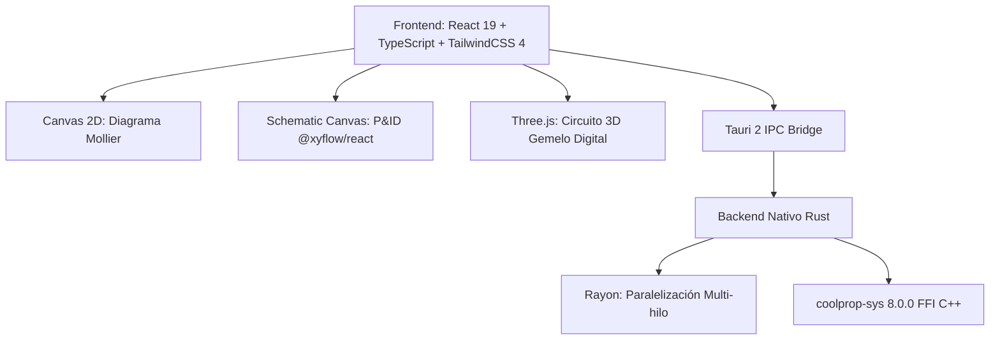

# CoolMollier — Diagramas Termodinámicos y Esquemas Frigoríficos (log(p)–h & P&ID)

<div align="center">


**Aplicación de escritorio profesional multiplataforma para el diseño, análisis, cálculo termodinámico, esquemas P&ID interactivos y simulación 3D de ciclos frigoríficos en diagramas Mollier log(p)–h.**

[](https://www.rust-lang.org/)
[](https://tauri.app/)
[](https://reactjs.org/)
[](https://www.typescriptlang.org/)
[](https://tailwindcss.com/)
[](https://threejs.org/)
[](https://reactflow.dev/)
[](http://www.coolprop.org/)

</div>

---

## 📑 Tabla de Contenidos
- [🌟 Descripción General](#-descripción-general)
- [🚀 Características Principales](#-características-principales)
  - [1. 📈 Diagrama log(p)–h Interactivo Vectorial](#1--diagrama-logp--h-interactivo-vectorial)
  - [2. 🗺️ Diseñador y Simulador de Esquemas Frigoríficos P&ID](#2-️-diseñador-y-simulador-de-esquemas-frigoríficos-pid)
  - [3. 🧊 Gemelo Digital 3D de la Instalación (Three.js)](#3--gemelo-digital-3d-de-la-instalación-threejs)
  - [4. ⚡ Balance Energético, Primer Principio y Rendimientos](#4--balance-energético-primer-principio-y-rendimientos)
  - [5. 🖥️ Modos de Visualización Flexibles y Vista Dividida](#5-️-modos-de-visualización-flexibles-y-vista-dividida)
  - [6. 🎨 Tema Claro y Oscuro (Light / Dark Mode)](#6--tema-claro-y-oscuro-light--dark-mode)
  - [7. 🛠️ Gestión Avanzada de Puntos y Procesos](#7-️-gestión-avanzada-de-puntos-y-procesos)
  - [8. 💾 Exportación Profesional y Persistencia](#8--exportación-profesional-y-persistencia)
- [🏛️ Decisiones de Arquitectura](#️-decisiones-de-arquitectura)
- [📊 Matriz de Refrigerantes Soportados](#-matriz-de-refrigerantes-soportados)
- [🔌 Catálogo de Componentes P&ID](#-catálogo-de-componentes-pid)
- [📐 Fórmulas y Metodología Termodinámica](#-fórmulas-y-metodología-termodinámica)
- [🛠️ Instalación y Entorno de Desarrollo](#️-instalación-y-entorno-de-desarrollo)
- [📁 Estructura del Proyecto](#-estructura-del-proyecto)
- [📄 Licencia](#-licencia)

---

## 🌟 Descripción General

**CoolMollier** es una suite de ingeniería termodinámica de última generación concebida para técnicos, proyectistas, ingenieros, docentes e investigadores del sector **HVAC&R** (Calefacción, Ventilación, Aire Acondicionado y Refrigeración). 

La plataforma fusiona:
1. La precisión inquebrantable de **CoolProp 8.0** compilado en binario nativo en **Rust** (con paralelismo multinúcleo `Rayon`).
2. Un motor gráfico ultrarrápido y reactivo en **React 19**, **TypeScript** y **TailwindCSS 4** encapsulado en **Tauri 2**.
3. Un **diseñador de esquemas P&ID interactivo** con animación dinámica de flujo de refrigerante (@xyflow/react).
4. Un **gemelo digital 3D** en **Three.js** con partículas y transiciones de fase en tiempo real.
5. Un panel de cálculo integral de **balance energético, potencias frigoríficas/térmicas, rendimientos COP y análisis exergético**.

---

## 🚀 Características Principales

### 1. 📈 Diagrama log(p)–h Interactivo Vectorial
- **Ejes termodinámicos de alta precisión**: Eje de ordenadas de presiones en escala logarítmica ($P\ [\text{bar(a)}]$) y eje de abscisas de entalpía lineal ($h\ [\text{kJ/kg}]$).
- **Campana de saturación completa**: Línea de líquido saturado ($x = 0$), línea de vapor saturado seco ($x = 1$), punto crítico e isotermas subenfriadas/sobrecalentadas.
- **Familias de curvas configurables y conmutables**:
  - **Isotermas ($T\ [^\circ\text{C}]$)**: Trazado completo desde líquido subenfriado hasta vapor sobrecalentado.
  - **Isentrópicas ($s\ [\text{kJ/(kg}\cdot\text{K)}]$)**: Guías para compresiones isentrópicas y análisis politrópicos.
  - **Isócoras ($v\ [\text{m}^3/\text{kg}]$)**: Curvas de volumen específico constante ($v = 1/\rho$).
  - **Líneas de título de vapor ($x$)**: Graduadas del $10\%$ al $90\%$ dentro de la campana bifásica.
- **Navegación fluida**: Zoom mediante rueda de ratón, paneo con arrastre, centrado y ajuste automático al rango termodinámico (*Fit to View*).
- **Inspector dinámico de cursor**: Lectura en tiempo real de $(P, T, h, s, v, x, \text{fase})$ bajo la posición exacta del ratón.

---

### 2. 🗺️ Diseñador y Simulador de Esquemas Frigoríficos P&ID
- **Lienzo P&ID basado en nodos y conexiones inteligentes**: Construcción visual de esquemas hidráulicos y frigoríficos arrastrando componentes desde una paleta categorizada.
- **Tuberías de refrigerante con código de colores según estado**:
  - 🔴 **Descarga HP**: Vapor sobrecalentado a alta presión.
  - 🟠 **Condensación**: Mezcla bifásica a alta presión.
  - 🟡 **Línea de Líquido**: Líquido subenfriado a alta presión.
  - 🔵 **Expansión**: Mezcla bifásica a baja temperatura y baja presión.
  - 🟣 **Aspiración LP**: Vapor sobrecalentado seco a baja presión.
  - 🔷 **Inyección Intermedia**: Vapor flash EVI / Economizador.
  - 🟤 **Línea de Aceite**: Circuitos de lubricación y retorno al cárter.
- **Animación interactiva del flujo**: Simulación de circulación de refrigerante en tuberías con alternancia de pausa/marcha en tiempo real.
- **Plantillas de circuitos preconfiguradas**:
  - *Ciclo Básico Danfoss*: Compresor, condensador, recipiente, TXV y evaporador.
  - *Ciclo Simple DX Estándar*: Con acumulador de succión, filtro deshidratador y visor.
  - *Ciclo con Economizador e Inyección de Vapor (EVI)*: Botella flash y compresor con puerto intermedio.
  - *Central Booster Transcrítico de $\text{CO}_2$ (R744)*: Gas Cooler, válvula HPV, Flash Tank y etapas MT/LT.
  - *Bomba de Calor Reversible*: Válvula inversora de 4 vías y válvula EEV bidireccional.
- **Panel de propiedades por componente**: Configuración de presiones, temperaturas, potencias, caídas de presión, etiquetas de instrumentación y modelos de catálogo.
- **Exportación de esquemas**: Descarga directa en **PNG de alta resolución** y **SVG vectorial**.

---

### 3. 🧊 Gemelo Digital 3D de la Instalación (Three.js)
- **Maqueta 3D animada**: Representación espacial de la instalación con modelado de componentes clave (compresor, condensador forzado, válvula de expansión y evaporador).
- **Simulación de partículas térmicas**: Partículas recorren las tuberías cambiando dinámicamente de color según el gradiente de entalpía y presión.
- **Inspección de equipos**: Selección interactiva de componentes para monitorizar estados locales ($P_{\text{in}}, P_{\text{out}}, T_{\text{in}}, T_{\text{out}}, \Delta h$).
- **Cámara orbital**: Control de órbita 3D completo (rotación, zoom y paneo).

---

### 4. ⚡ Balance Energético, Primer Principio y Rendimientos
- **Cálculo integral instantáneo**:
  - **Efecto frigorífico ($q_e$)** y **Potencia frigorífica ($\dot{Q}_e$)**: En $\text{kW}$, $\text{Frig/h}$ y $\text{TR}$ (toneladas de refrigeración).
  - **Trabajo de compresión ($w_c$)** y **Potencia eléctrica/consumida ($\dot{W}_c$)**: En $\text{kW}$, $\text{CV}$ y $\text{HP}$.
  - **Calor disipado ($q_c$)** y **Potencia de condensación ($\dot{Q}_c$)**: En $\text{kW}$.
  - **Verificación del Primer Principio de la Termodinámica**: Balance $\dot{Q}_e + \dot{W}_c \approx \dot{Q}_c$ con indicador porcentual de discrepancia.
  - **Coeficientes de operación**: $\text{COP}_{\text{frío}}$, $\text{COP}_{\text{calor}}$ (bomba de calor), $\text{COP}_{\text{Carnot}}$ y **rendimiento exergético** ($\eta_{\text{Carnot}}$).
  - **Caudales de refrigerante**: Caudal másico ($\dot{m}$) y caudal volumétrico de aspiración ($\dot{V}_{\text{asp}}$ en $\text{m}^3/\text{h}$ y $\text{L/s}$).
  - **Subenfriamiento ($\Delta T_{\text{sub}}$)** y **Recalentamiento ($\Delta T_{\text{rec}}$)**.

---

### 5. 🖥️ Modos de Visualización Flexibles y Vista Dividida
La aplicación ofrece 4 modos de trabajo adaptados a cada fase del diseño:
1. **Modo Diagrama**: Enfoque completo en el diagrama log(p)–h y tabla de puntos de estado.
2. **Modo Esquema**: Espacio de diseño P&ID con paleta de componentes y tuberías inteligentes.
3. **Modo 3D**: Gemelo digital tridimensional interactivo.
4. **Modo Split View (Vista Dividida)**: Diagrama Mollier y Esquema P&ID en paralelo sobre la misma pantalla con sincronización termodinámica.

---

### 6. 🎨 Tema Claro y Oscuro (Light / Dark Mode)
- Conmutación instantánea entre **Modo Oscuro** (ingeniería de alto contraste) y **Modo Claro** (preparado para documentación e informes impresos).
- Adaptación automática del renderizado de canvas 2D, esquemas P&ID, rejillas de isolíneas y tipografías.

---

### 7. 🛠️ Gestión Avanzada de Puntos y Procesos
- **Definición de estados termodinámicos**:
  - Creación interactiva por clic directo en el diagrama.
  - Edición precisa mediante pares de variables termodinámicas independientes: $(P, h)$, $(P, T)$, $(P, s)$, $(P, x)$, $(T, x)$, $(P, v)$.
  - Arrastre interactivo de puntos con recálculo dinámico en vivo.
- **Trazado de transformaciones**:
  - Procesos isentrópicos, isobáricos, isoentálpicos, isotérmicos y politrópicos.
  - Cierre y numeración automática de ciclos.
- **Biblioteca de ciclos de ejemplo**: Carga rápida con 1 clic de ciclos estándar (R134a, R744 transcrítico, R717 industrial, R407C con glide, etc.).

---

### 8. 💾 Exportación Profesional y Persistencia
- **Formato Nativo JSON (`.mollier.json`)**: Persistencia íntegra de proyectos, capas, puntos, transformaciones, esquemas P&ID y configuraciones.
- **Exportación a CSV**: Tabla de puntos y propiedades termodinámicas para análisis en hojas de cálculo.
- **Exportación de Diagrama a PNG en Alta Definición**: Descarga con resolución personalizable lista para informes y memorias técnicas.
- **Exportación de Esquemas P&ID**: Formatos PNG y SVG vectorial de alta fidelidad.

---

## 🏛️ Decisiones de Arquitectura



### ¿Por qué Rust + CoolProp Nativo en lugar de Python?
1. **Rendimiento Ultrarrápido (< 25 ms)**: La generación de las mallas de isolíneas y puntos de saturación se calcula en paralelo aprovechando todos los núcleos de la CPU con `Rayon`.
2. **Binario 100% Autónomo**: Sin dependencias de Python, entornos virtuales, ni intérpretes externos. La aplicación se distribuye como un único binario ultra ligero y rápido para Windows, macOS y Linux.
3. **Seguridad de Memoria y Concurrencia**: Invocaciones concurrentes al motor termodinámico protegidas contra *data races*.

---

## 📊 Matriz de Refrigerantes Soportados

| Grupo | Refrigerante | Fórmula / Denominación | GWP | Seguridad ASHRAE | Tipo Termodinámico |
|---|---|---|---|---|---|
| **Naturales** | **R717** | Amoníaco ($\text{NH}_3$) | 0 | B2L | Fluido puro natural ($T_c = 132.4\ ^\circ\text{C}, P_c = 113.3\ \text{bar}$) |
| | **R744** | Dióxido de carbono ($\text{CO}_2$) | 1 | A1 | Fluido puro / Transcrítico ($T_c = 31.0\ ^\circ\text{C}, P_c = 73.8\ \text{bar}$) |
| | **R290** | Propano ($\text{C}_3\text{H}_8$) | 3 | A3 | Hidrocarburo puro ($T_c = 96.7\ ^\circ\text{C}, P_c = 42.5\ \text{bar}$) |
| | **R600a** | Isobutano | 3 | A3 | Hidrocarburo puro ($T_c = 134.7\ ^\circ\text{C}, P_c = 36.3\ \text{bar}$) |
| | **R600** | Butano | 4 | A3 | Hidrocarburo puro ($T_c = 152.0\ ^\circ\text{C}, P_c = 38.0\ \text{bar}$) |
| | **R1270** | Propileno | 2 | A3 | Hidrocarburo puro ($T_c = 91.1\ ^\circ\text{C}, P_c = 45.6\ \text{bar}$) |
| **HFO y Bajo GWP** | **R513A** | Opteon XP10 | 631 | A1 | Mezcla azeotrópica (Reemplazo R134a) |
| | **R1234yf** | Solstice yf | 4 | A2L | HFO puro para automoción y climatización |
| | **R1234ze(E)** | Solstice ze | 7 | A2L | HFO puro |
| | **R1233zd(E)** | Solstice zd | 1 | A1 | HFO puro para baja presión / centrífugas |
| | **R448A** | Solstice N40 | 1387 | A1 | Mezcla zeotrópica con glide |
| | **R449A** | Opteon XP40 | 1397 | A1 | Mezcla zeotrópica con glide |
| | **R450A** | Solstice N13 | 605 | A1 | Mezcla zeotrópica |
| | **R452A** | Opteon XP44 | 2140 | A1 | Mezcla zeotrópica para transporte |
| | **R454B** | Opteon XL41 / Puron Advance | 466 | A2L | Mezcla zeotrópica (Reemplazo R410A) |
| | **R454C** | Opteon XL20 | 148 | A2L | Mezcla zeotrópica bajo GWP |
| | **R455A** | Solstice L40X | 148 | A2L | Mezcla zeotrópica bajo GWP |
| **HFC y Mezclas** | **R134a** | Tetrafluoroetano | 1430 | A1 | HFC puro estándar |
| | **R32** | Difluorometano | 675 | A2L | HFC puro de alta eficiencia |
| | **R404A** | HP62 | 3922 | A1 | Mezcla casi azeotrópica |
| | **R410A** | Puron / AZ-20 | 2088 | A1 | Mezcla casi azeotrópica |
| | **R407C** | Suva 407C | 1774 | A1 | Mezcla zeotrópica con glide |
| | **R407A** | Klea 407A | 2107 | A1 | Mezcla zeotrópica con glide |
| | **R407F** | Performax LT | 1825 | A1 | Mezcla zeotrópica con glide |
| | **R507A** | AZ-50 | 3985 | A1 | Mezcla azeotrópica |
| | **R125** | Pentafluoroetano | 3500 | A1 | HFC puro |
| | **R143a** | Trifluoroetano | 4470 | A2L | HFC puro |
| | **R152a** | Difluoroetano | 124 | A2 | HFC puro de bajo GWP |
| | **R422D** | ISCEON MO29 | 2729 | A1 | Mezcla retrofit directa |
| | **R438A** | ISCEON MO99 | 2264 | A1 | Mezcla retrofit directa |
| | **R417A** | ISCEON MO59 | 2346 | A1 | Mezcla retrofit directa |
| **Históricos** | **R22** | Clorodifluorometano | 1810 | A1 | HCFC histórico ($T_c = 96.2\ ^\circ\text{C}$) |
| | **R502** | - | 4657 | A1 | Mezcla azeotrópica histórica |
| | **R12** | Diclorodifluorometano | 10900 | A1 | CFC histórico |
| | **R11** | Triclorofluorometano | 4750 | A1 | CFC histórico |
| | **R123** | Diclorotrifluoroetano | 77 | B1 | HCFC para centrífugas |
| | **R124** | Clorotetrafluoroetano | 609 | A1 | HCFC puro |
| | **R23** | Trifluorometano | 14800 | A1 | HFC para ultra-baja temperatura |
| | **R508B** | Suva 95 | 13396 | A1 | Mezcla para ultra-baja temperatura |
| | **R500** | Carrene 7 | 8077 | A1 | Mezcla azeotrópica histórica |

---

## 🔌 Catálogo de Componentes P&ID

La paleta de componentes incluye más de 25 símbolos normalizados HVAC/R:

| Categoría | Componentes Disponibles |
|---|---|
| **Compresores & Bombas** | Compresor Scroll, Compresor Alternativo/Pistón, Compresor de Tornillo, Compresor Inverter con VFD, Compresor Compound de 2 Etapas, Bomba de Recirculación de Refrigerante Líquido. |
| **Intercambiadores de Calor** | Condensador por Aire, Condensador de Placas (Agua), Condensador Evaporativo, Gas Cooler Transcrítico $\text{CO}_2$, Evaporador DX por Aire, Evaporador de Placas (Chiller), Evaporador Inundado, Intercambiador Líquido-Aspiración (IHX/SLHX), Desrecalentador / Recuperador de Calor. |
| **Expansión & Regulación** | Válvula de Expansión Termostática (TXV), Válvula de Expansión Electrónica (EEV), Tubo Capilar, Válvula de Flotador, Regulador de Presión de Evaporación (KVP), Regulador de Presión de Cárter (KVL), Regulador de Presión de Condensación (KVR). |
| **Recipientes & Aceite** | Recipiente de Líquido Vertical, Recipiente de Líquido Horizontal, Acumulador de Succión, Separador de Aceite con Retorno al Cárter, Depósito Colector de Aceite, Botella Flash Economizadora (EVI). |
| **Válvulas & Seguridad** | Válvula Inversora de 4 Vías, Válvula Solenoide (NC), Válvula de Retención (Check), Válvula de Seguridad de Alivio de Presión (PRV), Válvula de Bypass de Gas Caliente (HGBP), Válvula de Bola / Servicio. |
| **Filtros & Visores** | Filtro Deshidratador de Tamiz Molecular, Visor de Líquido y Humedad. |
| **Instrumentación & Sensores** | Manómetro de Alta Presión (HP), Manómetro de Baja Presión (LP), Sonda de Temperatura (NTC/PT100), Presostato Dual Alta/Baja, Caudalímetro Másico, Vatímetro / Analizador de Red. |

---

## 📐 Fórmulas y Metodología Termodinámica

<details>
<summary><b>Ver Fórmulas de Balance y Coeficientes de Rendimiento</b></summary>

### Balance Energético
$$\dot{Q}_e = \dot{m} \cdot (h_{\text{evap,out}} - h_{\text{evap,in}})$$
$$\dot{W}_c = \dot{m} \cdot (h_{\text{comp,out}} - h_{\text{comp,in}})$$
$$\dot{Q}_c = \dot{m} \cdot (h_{\text{cond,in}} - h_{\text{cond,out}})$$

### Verificación del Primer Principio
$$\Delta \dot{E} = |\dot{Q}_c - (\dot{Q}_e + \dot{W}_c)|$$

### Coeficientes de Rendimiento (COP)
$$\text{COP}_{\text{frío}} = \frac{\dot{Q}_e}{\dot{W}_c} = \frac{q_e}{w_c}$$
$$\text{COP}_{\text{calor}} = \frac{\dot{Q}_c}{\dot{W}_c} = 1 + \text{COP}_{\text{frío}}$$
$$\text{COP}_{\text{Carnot}} = \frac{T_{\text{evap}} [\text{K}]}{T_{\text{cond}} [\text{K}] - T_{\text{evap}} [\text{K}]}$$
$$\eta_{\text{Carnot}} = \frac{\text{COP}_{\text{frío}}}{\text{COP}_{\text{Carnot}}}$$

### Caudal Volumétrico Aspirado
$$\dot{V}_{\text{asp}} = \dot{m} \cdot v_{\text{aspiración}}$$

</details>

---

## 🛠️ Instalación y Entorno de Desarrollo

### Requisitos Previos
- **Node.js**: v18 o superior (`npm` o `pnpm`)
- **Rust Toolchain**: `cargo` y `rustc` instalados vía [rustup.rs](https://rustup.rs/)
- **C/C++ Build Tools**: Necesario para la compilación de `coolprop-sys`:
  - **macOS**: `xcode-select --install`
  - **Windows**: Visual Studio C++ Build Tools (MSVC)
  - **Linux (Debian/Ubuntu)**: `sudo apt install build-essential pkg-config libglib2.0-dev libgtk-3-dev libwebkit2gtk-4.1-dev`

### 1. Clonar el Repositorio
```bash
git clone https://github.com/imjustkike/refrigerantes-mollier.git
cd refrigerantes-mollier
```

### 2. Instalar Dependencias del Frontend
```bash
npm install
```

### 3. Ejecutar en Modo Desarrollo (Vite + Hot Reload)
Para desarrollo web rápido en el navegador:
```bash
npm run dev
```

Para desarrollo con la ventana nativa de escritorio y el backend de Rust activo:
```bash
npm run tauri dev
```

### 4. Pruebas Unitarias
Ejecutar los tests unitarios del frontend (Vitest):
```bash
npm run test
```

Ejecutar las pruebas del motor termodinámico (Rust):
```bash
cargo test --manifest-path src-tauri/Cargo.toml
```

### 5. Compilar el Instalador de Producción
Para generar el instalador nativo según tu sistema operativo (`.dmg` en macOS, `.msi` / `.exe` en Windows, `.deb` / `.AppImage` en Linux):
```bash
npm run tauri build
```
Los instaladores generados se guardan en `src-tauri/target/release/bundle/`.

---

## 📁 Estructura del Proyecto

```text
refrigerantes-mollier/
├── src/
│   ├── components/
│   │   ├── Diagram/           # Canvas 2D interactivo del Diagrama Mollier log(p)-h
│   │   ├── Schematic/         # Editor P&ID (@xyflow/react), nodos, paleta, templates y SVG
│   │   ├── Refrigeration3D/   # Gemelo digital 3D interactivo con Three.js
│   │   ├── Header/            # Barra superior, selector de vista, fluido, tema y presets
│   │   ├── Sidebar/           # Gestión de capas, puntos, transformaciones e isolíneas
│   │   ├── PointsTable/       # Tabla dinámica de estados termodinámicos
│   │   └── Modals/            # Modales de matriz de fluidos, ciclos de ejemplo y exportación
│   ├── engine/                # Cálculos termodinámicos, interpolación y balance energético
│   ├── context/               # ProjectContext (estado global, fluido, puntos, tema y vistas)
│   ├── services/              # Cliente IPC de Tauri y fallback web
│   └── types/                 # Interfaces TypeScript para termodinámica, P&ID y UI
├── src-tauri/
│   ├── src/                   # Backend nativo Rust (comandos IPC y CoolProp FFI)
│   ├── libs/                  # Biblioteca CoolProp compilada
│   ├── Cargo.toml             # Dependencias Rust (Tauri, Rayon, Serde)
│   └── tauri.conf.json        # Configuración de empaquetado de la aplicación de escritorio
├── public/                    # Logotipos e iconos de la aplicación
└── package.json               # Dependencias de frontend (React 19, Tailwind 4, Three.js, etc.)
```

---

## 📄 Licencia

Este proyecto está bajo la Licencia MIT. Consulta el archivo [LICENSE](file:///Users/kike/Documents/repositorios/refrigerantes-mollier/LICENSE) para más información.
