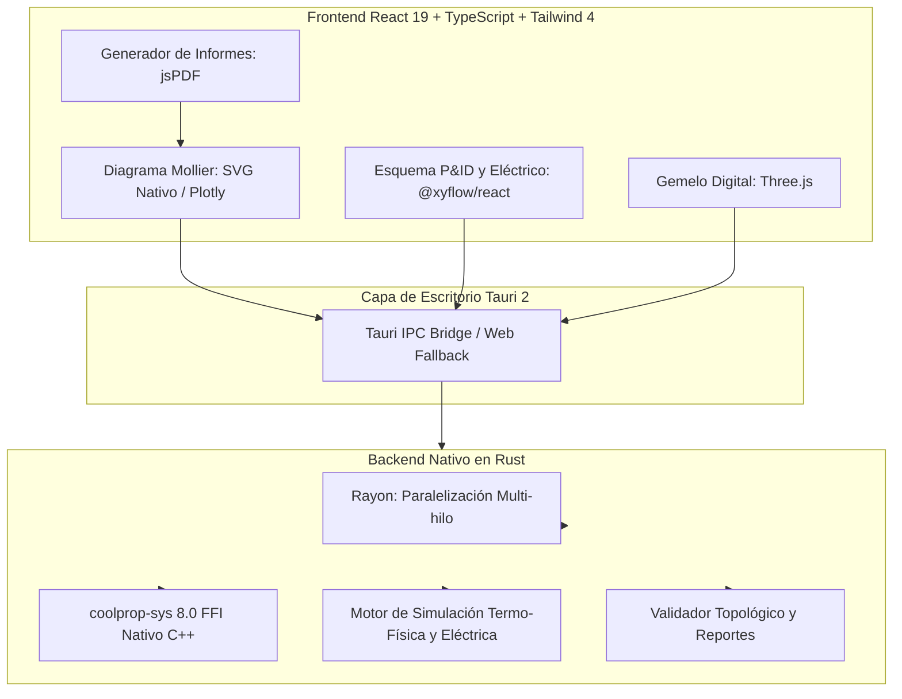

# CoolMollier — Diagramas Termodinámicos, Esquemas Frigoríficos (log(p)–h & P&ID) y Circuitos Eléctricos

<div align="center">


**Suite de ingeniería profesional multiplataforma para el diseño, análisis, cálculo termodinámico, esquemas P&ID interactivos, simulación dinámica de circuitos frigoríficos y eléctricos, y generación de informes PDF de alta resolución.**

[](https://www.rust-lang.org/)
[](https://tauri.app/)
[](https://reactjs.org/)
[](https://www.typescriptlang.org/)
[](https://tailwindcss.com/)
[](https://reactflow.dev/)
[](https://threejs.org/)
[](http://www.coolprop.org/)
[](https://github.com/parallax/jsPDF)
[](https://vitest.dev/)

</div>

---

## 📑 Tabla de Contenidos
- [🌟 Descripción General](#-descripción-general)
- [🚀 Características Principales](#-características-principales)
  - [1. 📈 Diagrama log(p)–h Interactivo Vectorial y Multi-Motor](#1--diagrama-logp--h-interactivo-vectorial-y-multi-motor)
  - [2. 🗺️ Diseñador y Simulador de Esquemas P&ID y Eléctricos](#2-️-diseñador-y-simulador-de-esquemas-pid-y-eléctricos)
  - [3. ⚡ Simulación Física, Hidráulica y Eléctrica en Tiempo Real](#3--simulación-física-hidráulica-y-eléctrica-en-tiempo-real)
  - [4. 📄 Generación de Informes Técnicos PDF y Exportación HD](#4--generación-de-informes-técnicos-pdf-y-exportación-hd)
  - [5. 🧊 Gemelo Digital 3D de la Instalación (Three.js)](#5--gemelo-digital-3d-de-la-instalación-threejs)
  - [6. 🔬 Balance Energético, Rendimientos y Primer Principio](#6--balance-energético-rendimientos-y-primer-principio)
  - [7. 🎨 Temas Visuales y Modos de Visualización](#7--temas-visuales-y-modos-de-visualización)
- [⌨️ Atajos de Teclado](#️-atajos-de-teclado)
- [🏛️ Decisiones de Arquitectura y Rendimiento](#️-decisiones-de-arquitectura-y-rendimiento)
- [📊 Matriz de Refrigerantes Soportados](#-matriz-de-refrigerantes-soportados)
- [🔌 Catálogo Completo de Componentes P&ID y Eléctricos](#-catálogo-completo-de-componentes-pid-y-eléctricos)
- [📐 Metodología de Cálculo Termodinámico](#-metodología-de-cálculo-termodinámico)
- [🛠️ Instalación y Entorno de Desarrollo](#️-instalación-y-entorno-de-desarrollo)
- [📁 Estructura del Proyecto](#-estructura-del-proyecto)
- [📄 Licencia](#-licencia)

---

## 🌟 Descripción General

**CoolMollier** es una suite de ingeniería termodinámica y simulación de última generación concebida para técnicos, proyectistas, ingenieros, docentes y estudiantes del sector **HVAC&R** (Calefacción, Ventilación, Aire Acondicionado y Refrigeración). 

La plataforma fusiona:
1. **Cálculos Termodinámicos Rigurosos**: Motor **CoolProp 8.0** compilado como binario nativo en **Rust** (con paralelismo multinúcleo `Rayon`) para la generación ultra-rápida de mallas de saturación, isotermas, isentrópicas, isócoras y títulos de vapor.
2. **Editor de Esquemas P&ID y Eléctricos Unificado**: Entorno gráfico basado en `@xyflow/react` con más de 70 componentes normalizados, arrastrar y soltar (*Drag & Drop*), rotación, reflejo (*flip*) y animación de fluidos por estado termodinámico.
3. **Simulador Dinámico Termo-Físico y Eléctrico**: Validación de circuitos en vivo, transitorios térmicos, migración de carga y resolución de circuitos de potencia y maniobra.
4. **Informes PDF de Grado Editorial**: Generador integrado de memorias de cálculo e informes técnicos con diagramas vectoriales de alta resolución, balance de energía y tablas de estados.
5. **Gemelo Digital 3D**: Simulación espacial interactiva desarrollada en **Three.js** con partículas dinámicas y gradiente de fases.

---

## 🚀 Características Principales

### 1. 📈 Diagrama log(p)–h Interactivo Vectorial y Multi-Motor
- **Ejes de Alta Precisión**: Ordenadas en escala logarítmica de presiones ($P\ [\text{bar(a)}]$) y abscisas lineales de entalpía específica ($h\ [\text{kJ/kg}]$).
- **Selector de Motor Gráfico**: Conmutación instantánea entre motor **SVG Nativo** (máximo rendimiento y nitidez vectorial) y **Plotly.js** (análisis interactivo avanzado).
- **Curvas de Estado y Familias Configurables**:
  - **Campana de Saturación**: Curva de líquido saturado ($x = 0$), vapor saturado seco ($x = 1$) y punto crítico.
  - **Isotermas ($T\ [^\circ\text{C}]$)**: Trazado continuo a través de líquido subenfriado, campana bifásica y vapor sobrecalentado.
  - **Isentrópicas ($s\ [\text{kJ/(kg}\cdot\text{K)}]$)**: Guías para compresiones teóricas y cálculo de rendimientos isentrópicos.
  - **Isócoras ($v\ [\text{m}^3/\text{kg}]$)**: Curvas de volumen específico constante ($v = 1/\rho$).
  - **Líneas de Título de Vapor ($x$)**: Graduadas del $10\%$ al $90\%$ en el interior de la campana.
- **Inspector Dinámico**: Cursor inteligente con lectura en tiempo real de $(P, T, h, s, v, x, \text{fase})$.
- **Gestión Avanzada de Puntos y Ciclos**:
  - Creación directa por clic sobre el canvas o ingreso exacto mediante pares $(P,h)$, $(P,T)$, $(P,s)$, $(P,x)$, $(T,x)$ o $(P,v)$.
  - Modificación arrastrando puntos con recálculo dinámico en caliente.
  - Cierre automático de ciclos y conector guiado de transformaciones.

---

### 2. 🗺️ Diseñador y Simulador de Esquemas P&ID y Eléctricos
- **Arrastrar y Soltar (*Drag & Drop*)**: Incorporación intuitiva de componentes desde la paleta lateral clasificada directamente al lienzo.
- **Manipulación Rápida de Componentes**:
  - **Rotación 90°** (`R`) en 4 orientaciones (0°, 90°, 180°, 270°) adaptando puertos de conexión.
  - **Volteo / Espejo Horizontal** (`H`) y **Vertical** (`V`) para alineación perfecta de tuberías.
  - **Duplicado Instantáneo** (`Ctrl+D` / `Cmd+D`) y eliminación rápida (`Supr` / `Backspace`).
- **Tuberías Frigoríficas Inteligentes con Código de Colores**:
  - 🔴 **Descarga HP**: Vapor sobrecalentado a alta presión.
  - 🟠 **Condensación**: Mezcla bifásica a alta presión.
  - 🟡 **Línea de Líquido**: Líquido subenfriado a alta presión.
  - 🔵 **Expansión**: Mezcla bifásica a baja temperatura y baja presión.
  - 🟣 **Aspiración LP**: Vapor sobrecalentado seco a baja presión.
  - 🔷 **Inyección Intermedia**: Vapor flash EVI / Economizador.
  - 🟤 **Línea de Aceite**: Circuitos de lubricación y retorno de aceite al cárter.
- **Esquemas Eléctricos y de Control Frigorífico**:
  - Acometidas de alimentación AC/DC monofásicas y trifásicas, bornas y tomas de tierra.
  - Elementos de mando: pulsadores NA/NC, selectores rotativos, setas de emergencia y conmutadores.
  - Aparamenta de protección: magnetotérmicos MCB, interruptores diferenciales RCD, fusibles seccionables y guardamotores.
  - Maniobra y automatismos: contactores trifásicos, bobinas auxiliares, contactos auxiliares NA/NC y temporizadores a la conexión (*on-delay*).
  - Cargas y receptores: motores monofásicos y trifásicos, resistencias de desescarche/cárter, electroválvulas solenoides, pilotos de señalización LED y sirenas/zumbadores.
  - Instrumentación de medida: voltímetros, amperímetros, vatímetros y multímetros digitales.
- **Plantillas Preconfiguradas Disponibles**:
  1. *Circuito Eléctrico Didáctico*: Batería + Interruptor + Lámpara.
  2. *Práctica Completa*: Doble compresor frigorífico con cámara de conservación.
  3. *Ciclo Básico Danfoss*: Compresor, condensador, recipiente de líquido, TXV y evaporador.
  4. *Ciclo Simple DX Estándar*: Con acumulador de succión, filtro deshidratador y visor de líquido.
  5. *Ciclo con Economizador e Inyección de Vapor (EVI)*: Botella flash y compresor con puerto intermedio.
  6. *Central Booster Transcrítico de $\text{CO}_2$ (R744)*: Gas Cooler, válvula HPV, Flash Tank y etapas de media/baja temperatura.
  7. *Bomba de Calor Reversible*: Válvula inversora de 4 vías y válvula EEV bidireccional.

---

### 3. ⚡ Simulación Física, Hidráulica y Eléctrica en Tiempo Real
- **Motor de Simulación Nativo en Rust**:
  - Resolución dinámica de presiones, temperaturas y caudales del refrigerante.
  - Transitorios de enfriamiento en cámaras frigoríficas y recintos acondicionados según carga térmica.
  - Modelado de migración y distribución de la carga de refrigerante (*refrigerant charge*).
- **Validador Topológico en Vivo**:
  - Análisis del circuito en busca de lazos abiertos, componentes sin conectar o incompatibilidades de puertos.
  - Diagnóstico interactivo con alertas de advertencia (*warnings*) y errores críticos de diseño.
- **Barra de Control de Simulación**:
  - Botones de **Play**, **Pause**, **Paso a Paso (Step)** y **Reset**.
  - Selector de velocidad dinámica ($0.5\times$, $1\times$, $2\times$, $5\times$).
  - Animación fluida de partículas en tuberías con indicador de estado (Flujo Activo / Flujo Detenido).

---

### 4. 📄 Generación de Informes Técnicos PDF y Exportación HD
- **Exportación de Informes PDF de Ingeniería (`jsPDF`)**:
  - Portada técnica formal con nombre de proyecto, refrigerante seleccionado, fecha y metadatos de autoría.
  - Diagrama log(p)–h completo renderizado con factor de escala DPI de alta nitidez.
  - Ficha técnica con propiedades críticas del fluido (temperatura crítica, presión crítica, fórmula molecular y masa molar).
  - Balance energético completo: potencias frigoríficas ($\text{kW}, \text{Frig/h}, \text{TR}$), potencia de compresión, calor disipado y balance del Primer Principio.
  - Tabla completa de puntos de estado con badges de fase (Líquido, Bifásico, Vapor Sobrecalentado, Supercrítico) y propiedades $(P, T, h, s, v, x)$.
- **Exportación de Diagramas Mollier**: Descarga directa en **PNG de alta resolución** (escala 1x, 2x, 3x) y archivo vectorial.
- **Exportación de Esquemas P&ID y Eléctricos**: Formatos **PNG HD** y **SVG vectorial** descargables con 1 clic.
- **Persistencia de Proyectos**: Guardado y apertura completa mediante formato nativo JSON (`.mollier.json`) y exportación de datos tabulares a **CSV**.

---

### 5. 🧊 Gemelo Digital 3D de la Instalación (Three.js)
- **Visualización Tridimensional Interactiva**: Representación espacial de equipos clave (compresor, condensador forzado, válvula de laminación y evaporador).
- **Tuberías con Flujo de Partículas Térmicas**: Partículas que se desplazan dinámicamente cambiando de color según la entalpía y presión calculadas.
- **Inspección de Equipos**: Selección de componentes 3D con visualización de parámetros locales ($P_{\text{in}}, P_{\text{out}}, T_{\text{in}}, T_{\text{out}}, \Delta h$).
- **Cámara Orbital Libre**: Rotación 360°, paneo y zoom con ratón o gestos táctiles.

---

### 6. 🔬 Balance Energético, Rendimientos y Primer Principio
- **Efecto Frigorífico ($q_e$) y Potencia Frigorífica ($\dot{Q}_e$)**: Expresados en $\text{kW}$, $\text{Frig/h}$ y $\text{TR}$ (toneladas de refrigeración).
- **Trabajo de Compresión ($w_c$) y Potencia Consumida ($\dot{W}_c$)**: Expresados en $\text{kW}$, $\text{CV}$ y $\text{HP}$.
- **Calor Disipado ($q_c$) y Potencia de Condensación ($\dot{Q}_c$)**: En $\text{kW}$.
- **Verificación del Primer Principio de la Termodinámica**: Comparativa $\dot{Q}_e + \dot{W}_c \approx \dot{Q}_c$ con cálculo del error porcentual relativo.
- **Coeficientes de Operación (COP)**:
  - $\text{COP}_{\text{frío}}$ (modo refrigeración).
  - $\text{COP}_{\text{calor}}$ (modo bomba de calor).
  - $\text{COP}_{\text{Carnot}}$ teórico entre temperaturas de evaporación y condensación.
  - **Eficiencia Exergética** ($\eta_{\text{Carnot}}$).
- **Caudales**: Caudal másico de refrigerante ($\dot{m}$) y caudal volumétrico de aspiración ($\dot{V}_{\text{asp}}$ en $\text{m}^3/\text{h}$ y $\text{L/s}$).
- **Grados de Subenfriamiento ($\Delta T_{\text{sub}}$) y Recalentamiento ($\Delta T_{\text{rec}}$)**.

---

### 7. 🎨 Temas Visuales y Modos de Visualización
- **Modos de Vista de Trabajo**:
  - **Mollier**: Enfoque completo en el diagrama log(p)–h, gestión de isolíneas y tabla de puntos.
  - **Esquema P&ID**: Lienzo de diseño de instalaciones mecánicas y esquemas de maniobra eléctrica.
  - **Ciclo 3D**: Gemelo digital tridimensional interactivo.
- **Selector de Tema Dinámico**:
  - **Modo Oscuro (Dark)**: Fondo de contraste para trabajo prolongado en sala técnica o laboratorio.
  - **Modo Claro (Danfoss / Light)**: Adaptado para documentación, proyección en aula e informes impresos.
- **Catálogo de Refrigerantes Integrado en Barra Lateral**: Búsqueda en tiempo real y filtrado por grupos de fluidos.

---

## ⌨️ Atajos de Teclado

### En el Esquema P&ID y Eléctrico
| Atajo | Acción |
|---|---|
| <kbd>R</kbd> | Rotar el componente seleccionado 90° en sentido horario (0° → 90° → 180° → 270°) |
| <kbd>H</kbd> | Voltear componente horizontalmente (*Flip Horizontal / Modo Espejo*) |
| <kbd>V</kbd> | Voltear componente verticalmente (*Flip Vertical*) |
| <kbd>Ctrl</kbd> + <kbd>D</kbd> / <kbd>Cmd</kbd> + <kbd>D</kbd> | Duplicar el componente seleccionado con offset |
| <kbd>Supr</kbd> / <kbd>Backspace</kbd> | Eliminar componente o tubería seleccionada |
| <kbd>Espacio</kbd> + Arrastrar | Paneo libre por el lienzo |
| Rueda del ratón | Zoom continuo centrado en el cursor |

### En el Diagrama Mollier
| Atajo / Acción | Descripción |
|---|---|
| Clic izquierdo sobre el fondo | Añadir nuevo punto de estado termodinámico |
| Clic y arrastre de punto | Desplazar estado con recálculo dinámico en vivo |
| Botón *Cerrar Ciclo* | Une automáticamente el último punto con el primero para cerrar el circuito |
| Botón *Restablecer Vista* | Ajusta el zoom y límites de los ejes a la campana del fluido activo |

---

## 🏛️ Decisiones de Arquitectura y Rendimiento



### Ventajas del Stack Tecnológico
1. **Velocidad Extrema (< 20 ms)**: La generación de las familias de curvas e isolíneas se distribuye entre todos los hilos del procesador mediante `Rayon`.
2. **Binario 100% Autónomo y Portable**: Sin dependencias de Python, entornos conda ni librerías dinámicas del sistema. Se compila en un ejecutable ultra ligero para Windows, macOS y Linux.
3. **Multiplataforma Robusta**: Compatible con Microsoft Visual Studio C++ (MSVC) en Windows y clang/Xcode en macOS.
4. **Resistencia a Fallos**: En caso de uso en navegador web sin backend nativo, dispone de un motor de fallback termodinámico en TypeScript.

---

## 📊 Matriz de Refrigerantes Soportados

| Grupo | Refrigerante | Denominación / Nombre Comercial | GWP | Seguridad ASHRAE | Propiedades Críticas |
|---|---|---|---|---|---|
| **Naturales** | **R717** | Amoníaco ($\text{NH}_3$) | 0 | B2L | $T_c = 132.4\ ^\circ\text{C}, P_c = 113.3\ \text{bar}$ |
| | **R744** | Dióxido de carbono ($\text{CO}_2$) | 1 | A1 | $T_c = 31.0\ ^\circ\text{C}, P_c = 73.8\ \text{bar}$ (Transcrítico) |
| | **R290** | Propano ($\text{C}_3\text{H}_8$) | 3 | A3 | $T_c = 96.7\ ^\circ\text{C}, P_c = 42.5\ \text{bar}$ |
| | **R600a** | Isobutano | 3 | A3 | $T_c = 134.7\ ^\circ\text{C}, P_c = 36.3\ \text{bar}$ |
| | **R600** | Butano normal | 4 | A3 | $T_c = 152.0\ ^\circ\text{C}, P_c = 38.0\ \text{bar}$ |
| | **R1270** | Propileno | 2 | A3 | $T_c = 91.1\ ^\circ\text{C}, P_c = 45.6\ \text{bar}$ |
| **HFO y Bajo GWP** | **R513A** | Opteon XP10 | 631 | A1 | Reemplazo directo R134a (Azeótropo) |
| | **R1234yf** | Solstice yf | 4 | A2L | HFO puro para automoción y bombas de calor |
| | **R1234ze(E)** | Solstice ze | 7 | A2L | HFO puro |
| | **R1233zd(E)** | Solstice zd | 1 | A1 | HFO baja presión para plantas enfriadoras |
| | **R448A** | Solstice N40 | 1387 | A1 | Mezcla zeotrópica con glide |
| | **R449A** | Opteon XP40 | 1397 | A1 | Mezcla zeotrópica con glide |
| | **R450A** | Solstice N13 | 605 | A1 | Mezcla zeotrópica bajo GWP |
| | **R452A** | Opteon XP44 | 2140 | A1 | Mezcla zeotrópica para transporte frigorífico |
| | **R454B** | Opteon XL41 / Puron Advance | 466 | A2L | Reemplazo R410A en climatización |
| | **R454C** | Opteon XL20 | 148 | A2L | Mezcla bajo GWP (< 150) |
| | **R455A** | Solstice L40X | 148 | A2L | Mezcla bajo GWP (< 150) |
| **HFC y Mezclas** | **R134a** | 1,1,1,2-Tetrafluoroetano | 1430 | A1 | Fluido de referencia estándar |
| | **R32** | Difluorometano | 675 | A2L | HFC puro para aire acondicionado |
| | **R404A** | HP62 | 3922 | A1 | Mezcla comercial estándar MT/LT |
| | **R410A** | Puron / AZ-20 | 2088 | A1 | Mezcla de alta presión |
| | **R407C** | Suva 407C | 1774 | A1 | Mezcla zeotrópica con glide notable |
| | **R407A** | Klea 407A | 2107 | A1 | Mezcla zeotrópica para refrigeración |
| | **R407F** | Performax LT | 1825 | A1 | Mezcla zeotrópica alto rendimiento |
| | **R507A** | AZ-50 | 3985 | A1 | Mezcla azeotrópica |
| | **R125** | Pentafluoroetano | 3500 | A1 | HFC puro componente de mezclas |
| | **R143a** | Trifluoroetano | 4470 | A2L | HFC puro componente de mezclas |
| | **R152a** | 1,1-Difluoroetano | 124 | A2 | HFC de bajo impacto ambiental |
| | **R422D** | ISCEON MO29 | 2729 | A1 | Mezcla retrofit para sustitución directa |
| | **R438A** | ISCEON MO99 | 2264 | A1 | Mezcla retrofit directa de R22 |
| | **R417A** | ISCEON MO59 | 2346 | A1 | Mezcla retrofit |
| **Históricos y CFC** | **R22** | Clorodifluorometano | 1810 | A1 | HCFC histórico ($T_c = 96.2\ ^\circ\text{C}$) |
| | **R502** | - | 4657 | A1 | Mezcla azeotrópica histórica |
| | **R12** | Diclorodifluorometano | 10900 | A1 | CFC histórico |
| | **R11** | Triclorofluorometano | 4750 | A1 | CFC centrífugo |
| | **R123** | Diclorotrifluoroetano | 77 | B1 | HCFC para plantas enfriadoras |
| | **R124** | Clorotetrafluoroetano | 609 | A1 | HCFC puro |
| | **R23** | Trifluorometano | 14800 | A1 | HFC para ultra-baja temperatura |
| | **R508B** | Suva 95 | 13396 | A1 | Mezcla para cascadas de ultra-baja temperatura |
| | **R500** | Carrene 7 | 8077 | A1 | Mezcla histórica |

---

## 🔌 Catálogo Completo de Componentes P&ID y Eléctricos

La biblioteca cuenta con más de **70 símbolos normalizados** organizados en paletas temáticas:

| Categoría | Símbolos y Dispositivos Disponibles |
|---|---|
| **Compresores & Bombas** | Compresor Scroll, Compresor Alternativo/Pistón, Compresor de Tornillo, Compresor Inverter con VFD, Compresor Compound de 2 Etapas, Bomba de Recirculación de Refrigerante Líquido. |
| **Intercambiadores de Calor** | Condensador por Aire, Condensador de Placas (Agua), Condensador Evaporativo, Gas Cooler Transcrítico $\text{CO}_2$, Evaporador DX por Aire, Evaporador de Placas (Chiller), Evaporador Inundado, Intercambiador Líquido-Aspiración (IHX/SLHX), Desrecalentador / Recuperador de Calor. |
| **Expansión & Regulación** | Válvula de Expansión Termostática (TXV), Válvula de Expansión Electrónica (EEV), Tubo Capilar, Válvula de Flotador, Regulador de Presión de Evaporación (KVP), Regulador de Presión de Cárter (KVL), Regulador de Presión de Condensación (KVR). |
| **Recipientes & Aceite** | Recipiente de Líquido Vertical, Recipiente de Líquido Horizontal, Acumulador de Succión, Separador de Aceite con Retorno al Cárter, Depósito Colector de Aceite, Botella Flash Economizadora (EVI), Depósito Flash Intermedio $\text{CO}_2$. |
| **Válvulas & Seguridad** | Válvula Inversora de 4 Vías, Válvula Solenoide (NC), Válvula de Retención (Check), Válvula de Seguridad de Alivio (PRV), Válvula de Bypass de Gas Caliente (HGBP), Válvula de Bola / Servicio. |
| **Filtros & Visores** | Filtro Deshidratador de Tamiz Molecular, Visor de Líquido y Humedad. |
| **Accesorios de Tubería (Fittings)** | Unión Recta, Codo a 90°, Te de Derivación (Tee), Cruz de Derivación, Punto de Conexión Hidráulico. |
| **Instrumentación & Sensores** | Manómetro de Alta Presión (HP), Manómetro de Baja Presión (LP), Sonda de Temperatura (PT100/NTC), Presostato Dual Alta/Baja, Caudalímetro Másico, Vatímetro de Potencia. |
| **Cámaras Frigoríficas & Recintos** | Cámara de Conservación de Frescos (+0 a +4 °C), Cámara de Congelados (-18 a -25 °C), Abatidor de Temperatura / Túnel de Congelación, Sala Climatizada de Proceso, Cámara de Fermentación Controlada, Cámara de Maduración, Cámara de Secado, Silo de Almacenamiento de Hielo. |
| **Alimentación & Distribución Eléctrica** | Cuadro Eléctrico Principal, Borna de Alimentación, Fuente DC, Alimentación AC Monofásica, Alimentación AC Trifásica (3P), Pila / Celda DC, Batería, Toma de Tierra, Terminal de Neutro, Conector Clavija/Base. |
| **Protecciones Eléctricas** | Interruptor Magnetotérmico (MCB), Interruptor Diferencial (RCD), Guardamotor Magnetotérmico, Interruptor Seccionador, Seccionador Fusible, Relé Térmico de Sobrecarga. |
| **Aparamenta de Mando & Control** | Pulsador NA (Start), Pulsador NC (Stop), Pulsador Simple, Pulsador NC Simple, Selector Rotativo de Posiciones, Seta de Parada de Emergencia, Interruptor Unipolar SPST, Interruptor Conmutador SPDT. |
| **Relés, Contactores & Temporizadores** | Contactor de Potencia Trifásico, Bobina de Relé Auxiliar, Contacto Auxiliar NA, Contacto Auxiliar NC, Temporizador a la Conexión (*On-Delay*), Temporizador a la Desconexión (*Off-Delay*). |
| **Transformación & Fuentes** | Transformador de Mando y Maniobra, Fuente de Alimentación Conmutada 24V DC. |
| **Cargas, Motores & Actuadores** | Motor Eléctrico Trifásico (3P), Motor Eléctrico Monofásico (1P), Resistencia Eléctrica de Cárter/Desescarche, Bobina Solenoide para Válvulas, Bombilla / Lámpara Testigo, Variador de Frecuencia (VFD), Arrancador Suave (*Soft Starter*). |
| **Señalización Acústica & Luminosa** | Piloto Luminoso Verde (Marcha), Piloto Luminoso Rojo (Fallo/Paro), Piloto Luminoso Ámbar (Alarma), Diodo LED, Zumbador / Sirena Acústica. |
| **Medida & Componentes Pasivos** | Voltímetro Analógico/Digital, Amperímetro, Ohmímetro, Vatímetro, Multímetro Digital, Resistencia Fija, Potenciómetro Regulable, Condensador. |

---

## 📐 Metodología de Cálculo Termodinámico

<details>
<summary><b>Ver Fórmulas del Balance Energético y Rendimientos</b></summary>

### Balance Energético en Régimen Estacionario
$$\dot{Q}_e = \dot{m} \cdot (h_{\text{evap,out}} - h_{\text{evap,in}})$$
$$\dot{W}_c = \dot{m} \cdot (h_{\text{comp,out}} - h_{\text{comp,in}})$$
$$\dot{Q}_c = \dot{m} \cdot (h_{\text{cond,in}} - h_{\text{cond,out}})$$

### Verificación del Primer Principio
$$\Delta \dot{E} = |\dot{Q}_c - (\dot{Q}_e + \dot{W}_c)|$$
$$\text{Error Relativo} = \frac{\Delta \dot{E}}{\dot{Q}_c} \cdot 100\ [\%]$$

### Coeficientes de Rendimiento (COP)
$$\text{COP}_{\text{frío}} = \frac{\dot{Q}_e}{\dot{W}_c} = \frac{q_e}{w_c}$$
$$\text{COP}_{\text{calor}} = \frac{\dot{Q}_c}{\dot{W}_c} = 1 + \text{COP}_{\text{frío}}$$
$$\text{COP}_{\text{Carnot}} = \frac{T_{\text{evap}} [\text{K}]}{T_{\text{cond}} [\text{K}] - T_{\text{evap}} [\text{K}]}$$
$$\eta_{\text{Carnot}} = \frac{\text{COP}_{\text{frío}}}{\text{COP}_{\text{Carnot}}}$$

### Caudal Volumétrico de Aspiración
$$\dot{V}_{\text{asp}} = \dot{m} \cdot v_{\text{aspiración}} \quad [\text{m}^3/\text{s} \rightarrow \text{m}^3/\text{h}, \text{L/s}]$$

</details>

---

## 🛠️ Instalación y Entorno de Desarrollo

### Requisitos Previos
- **Node.js**: v18 o superior (`npm` recomendado)
- **Rust Toolchain**: `cargo` y `rustc` (v1.75+) instalados vía [rustup.rs](https://rustup.rs/)
- **Compilador C/C++**: Requerido para compilar las librerías C++ nativas de CoolProp (`coolprop-sys`):
  - **macOS**: `xcode-select --install`
  - **Windows**: Visual Studio C++ Build Tools (incluyendo MSVC y Windows SDK)
  - **Linux (Debian/Ubuntu)**: `sudo apt update && sudo apt install -y build-essential pkg-config libglib2.0-dev libgtk-3-dev libwebkit2gtk-4.1-dev`

### 1. Clonar el Repositorio
```bash
git clone https://github.com/imjustkike/refrigerantes-mollier.git
cd refrigerantes-mollier
```

### 2. Instalar Dependencias del Frontend
```bash
npm install
```

### 3. Ejecutar en Modo Desarrollo

Para desarrollo web con recarga rápida (*Hot Module Reload*):
```bash
npm run dev
```

Para arrancar la aplicación de escritorio nativa completa con backend Rust:
```bash
npm run tauri dev
```

### 4. Pruebas Automatizadas
Ejecutar la suite de tests unitarios de frontend (Vitest):
```bash
npm run test
```

Ejecutar las pruebas del backend en Rust:
```bash
cargo test --manifest-path src-tauri/Cargo.toml
```

### 5. Compilar el Paquete de Producción
Genera el instalador ejecutable nativo para tu sistema operativo (`.dmg` en macOS, instalador `.msi` / `.exe` en Windows, paquete `.deb` / `.AppImage` en Linux):
```bash
npm run tauri build
```
Los binarios empaquetados e instaladores se guardarán en `src-tauri/target/release/bundle/`.

---

## 📁 Estructura del Proyecto

```text
refrigerantes-mollier/
├── src/
│   ├── components/
│   │   ├── Diagram/           # Canvas 2D interactivo del Diagrama Mollier log(p)-h
│   │   ├── Schematic/         # Editor P&ID y Eléctrico (@xyflow/react)
│   │   │   ├── nodes/         # Nodos personalizables con rotación y flip
│   │   │   ├── symbols/       # Definiciones de 70+ componentes y símbolos SVG
│   │   │   ├── simulation/    # Interfaz de control y monitorización de simulación
│   │   │   └── templates/     # Circuitos frigoríficos y didácticos preconfigurados
│   │   ├── Refrigeration3D/   # Gemelo digital 3D interactivo con Three.js
│   │   ├── Header/            # Barra superior, selector de vista (Mollier/P&ID/3D), tema y curvas
│   │   ├── Sidebar/           # Catálogo de fluidos con buscador, gestión de puntos y capas
│   │   ├── PointsTable/       # Tabla dinámica de estados termodinámicos
│   │   └── Modals/            # Diálogos de exportación (PDF / PNG / SVG), matrices y presets
│   ├── engine/                # Cálculos termodinámicos, interpolación, isolíneas y solver
│   ├── context/               # ProjectContext (estado global, fluido, puntos, tema y vistas)
│   ├── services/              # Cliente IPC de Tauri y fallback web en TypeScript
│   ├── utils/                 # Generación de PDF (jsPDF), exportación de esquemas y formateadores
│   └── types/                 # Tipos TypeScript para termodinámica, P&ID, eléctrica y simulación
├── src-tauri/
│   ├── src/
│   │   ├── pid_sim/           # Motor de simulación física, eléctrica, transitorios y validador
│   │   ├── thermo/            # Enlaces termodinámicos con CoolProp FFI
│   │   ├── commands.rs        # Comandos IPC expuestos a la interfaz Tauri
│   │   └── lib.rs             # Configuración del runtime Tauri
│   ├── libs/                  # Biblioteca CoolProp compilada
│   ├── Cargo.toml             # Manifiesto de dependencias en Rust
│   └── tauri.conf.json        # Configuración de empaquetado de la aplicación de escritorio
├── public/                    # Logotipos, favicons e iconos de la aplicación
├── package.json               # Dependencias de frontend (React 19, Tailwind 4, Three.js, etc.)
└── vite.config.ts             # Configuración de Vite y plugins
```

---

## 📄 Licencia

Este proyecto está bajo la Licencia MIT. Consulta el archivo [LICENSE](LICENSE) para más información.
