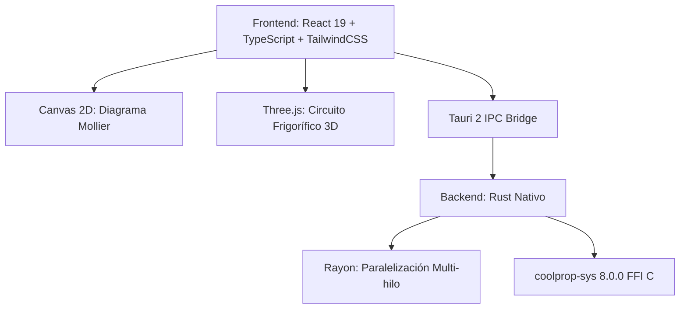

# CoolMollier — Diagramas Termodinámicos de Refrigerantes (log(p)–h)

<div align="center">


**Aplicación de escritorio profesional multiplataforma para el análisis, cálculo termodinámico, simulación 3D y trazado de ciclos frigoríficos en diagramas Mollier log(p)–h.**

[](https://www.rust-lang.org/)
[](https://tauri.app/)
[](https://reactjs.org/)
[](https://www.typescriptlang.org/)
[](https://threejs.org/)
[](http://www.coolprop.org/)

</div>

---

## 🌟 Descripción General

**CoolMollier** es una herramienta de ingeniería termodinámica diseñada para técnicos, ingenieros, estudiantes e investigadores del sector de la climatización y la refrigeración (HVAC&R). Combina la potencia y exactitud de **CoolProp 8.0** compilado nativamente en **Rust** con una interfaz gráfica interactiva, reactiva y fluida desarrollada en **React 19**, **TypeScript** y **Tauri 2**, complementada con un gemelo digital interactivo en **3D (Three.js)** y un panel de **balance energético integral**.

---

## 🚀 Características Principales

### 1. 📈 Diagrama log(p)–h Interactivo Vectorial
- **Escala industrial precisa**: Eje vertical de presiones en escala logarítmica ($P\ [\text{bar(a)}]$) y eje horizontal de entalpía lineal ($h\ [\text{kJ/kg}]$).
- **Campana de saturación termodinámica**: Curvas de líquido saturado ($Q=0$) y vapor saturado seco ($Q=1$), punto crítico e isotermas subenfriadas/sobrecalentadas.
- **Familias de curvas configurables**:
  - **Isotermas ($T\ [^\circ\text{C}]$)**: Desde subenfriamiento hasta sobrecalentamiento.
  - **Isentrópicas ($s\ [\text{kJ/(kg}\cdot\text{K)}]$)**: Guías para compresiones teóricas.
  - **Isócoras ($v\ [\text{m}^3/\text{kg}]$)**: Volumen específico $v = 1/\rho$.
  - **Líneas de título de vapor ($x$)**: De $10\%$ a $90\%$ dentro de la campana bifásica.
- **Navegación fluida**: Zoom con rueda de ratón, paneo con arrastre, ajuste automático al dominio termodinámico del fluido (*Fit to View*).
- **Inspector dinámico en tiempo real**: Muestra $(P, T, h, s, v, \text{fase})$ bajo la posición exacta del cursor.

---

### 2. ⚡ Esquema de Balance Energético y Rendimientos
- **Cálculo integral del ciclo frigorífico**:
  - **Efecto frigorífico útil ($q_e$)** y **Potencia frigorífica ($\dot{Q}_e$)** en $\text{kW}$, $\text{Frig/h}$ y $\text{TR}$ (toneladas de refrigeración).
  - **Trabajo de compresión específico ($w_c$)** y **Potencia consumida ($\dot{W}_c$)** en $\text{kW}$, $\text{CV}$ y $\text{HP}$.
  - **Calor disipado en condensación ($q_c$)** y **Potencia térmica ($\dot{Q}_c$)** en $\text{kW}$.
  - **Verificación del Primer Principio**: Comprobación automática del balance energético $(\dot{Q}_e + \dot{W}_c \approx \dot{Q}_c)$ con cálculo del porcentaje de desviación.
  - **Coeficientes de rendimiento**: $\text{COP}_{\text{frigorífico}}$, $\text{COP}_{\text{calorífico}}$ (bomba de calor), $\text{COP}_{\text{Carnot}}$ y **rendimiento exergético** ($\eta_{\text{Carnot}}$).
  - **Caudales**: Caudal másico ($\dot{m}$) y caudal volumétrico de aspiración al compresor ($\dot{V}_{\text{asp}}$ en $\text{m}^3/\text{h}$ y $\text{L/s}$).
  - **Parámetros de control**: Recalentamiento total/útil ($\Delta T_{\text{rec}}$) y Subenfriamiento ($\Delta T_{\text{sub}}$).

---

### 3. 🧊 Gemelo Digital 3D de la Instalación (Three.js)
- **Maqueta 3D animada interactiva**: Visualización espacial del circuito frigorífico con sus 4 componentes clave:
  - **Compresor** (Hermético / Semihermético / Scroll).
  - **Condensador** con ventilación forzada.
  - **Válvula de Expansión Termostática (VET)** / Tubo capilar.
  - **Evaporador** de expansión directa.
- **Flujo y transición de fases en tiempo real**: Simulación de partículas de refrigerante recorriendo las tuberías con gradiente de color según estado termodinámico:
  - 🔴 *Rojo*: Vapor sobrecalentado a alta presión (descarga del compresor).
  - 🟠 *Naranja*: Condensación bifásica a alta presión.
  - 🟡 *Amarillo/Ámbar*: Líquido subenfriado (salida de condensador).
  - 🔵 *Azul*: Expansión y mezcla líquido-vapor a baja presión (evaporador).
  - 🟣 *Morado*: Vapor recalentado a baja presión (aspiración al compresor).
- **Inspección de componentes**: Clic sobre cualquier equipo 3D para consultar sus variables de estado asociadas ($P_{\text{in}}, P_{\text{out}}, T_{\text{in}}, T_{\text{out}}, \Delta h$).
- **Vistas intercambiables**: Modo **Diagrama 2D**, Modo **Circuito 3D** o **Vista Dividida (Split View)** simultánea.

---

### 4. 🎨 Tema Claro y Oscuro (Light / Dark Mode)
- Soporte nativo para alternar entre **Modo Oscuro** y **Modo Claro**.
- Adaptación automática del canvas de renderizado, rejilla de isolíneas, tipografías y paleta de alto contraste.

---

### 5. 🛠️ Gestión de Puntos, Procesos y Ciclos
- **Definición de estados termodinámicos**:
  - Inserción por clic en el diagrama o mediante pares de propiedades ($P\text{-}h, P\text{-}T, P\text{-}s, P\text{-}Q, T\text{-}Q, P\text{-}v$).
  - Arrastre interactivo de puntos con recálculo dinámico.
  - Etiquetas con desplazamiento independiente ($T, P, h, v$).
- **Trazado de procesos**:
  - Procesos isentrópicos, isobáricos, isoentálpicos, isotérmicos y politrópicos.
  - Función de cierre automático del ciclo.
- **Ciclos de ejemplo incluidos**:
  - Ciclo estándar con R134a (refrigeración comercial).
  - Ciclo transcrítico con R744 ($\text{CO}_2$).
  - Ciclo industrial con R717 (Amoníaco).
  - Ciclo con mezcla zeotrópica y glide con R407C.

---

### 6. 💾 Exportación y Persistencia
- **Proyectos JSON (`.mollier.json`)**: Guardado y apertura completa de estados, conexiones y configuraciones.
- **Exportación a CSV**: Tabla de puntos y propiedades de estado normalizadas.
- **Exportación a PNG en Alta Resolución**: Captura vectorial del diagrama listo para informes técnicos.

---

## 🏛️ Decisiones de Arquitectura



### Backend Rust Nativo (`coolprop-sys 8.0.0`) vs Python
1. **Rendimiento instantáneo**: Malla de isolíneas y puntos de saturación calculados en menos de **25 ms** mediante paralelismo con `Rayon`.
2. **Binario 100% autónomo**: Cero dependencias externas o runtimes embebidos de Python. Ejecutable ultra ligero y distribución limpia en Windows, macOS y Linux.
3. **Seguridad de memoria**: Sincronización multi-hilo segura con la API de `CoolPropLib`.

---

## 📊 Matriz de Refrigerantes Soportados

| Grupo | Refrigerante | Fórmula / Alias | GWP | Seguridad ASHRAE | Tipo Termodinámico |
|---|---|---|---|---|---|
| **Naturales** | **R717** | Amoníaco ($\text{NH}_3$) | 0 | B2L | Fluido puro natural ($T_c = 132.4\ ^\circ\text{C}, P_c = 113.3\ \text{bar}$) |
| | **R744** | Dióxido de carbono ($\text{CO}_2$) | 1 | A1 | Fluido puro / Transcrítico ($T_c = 31.0\ ^\circ\text{C}, P_c = 73.8\ \text{bar}$) |
| | **R290** | Propano ($\text{C}_3\text{H}_8$) | 3 | A3 | Hidrocarburo puro ($T_c = 96.7\ ^\circ\text{C}, P_c = 42.5\ \text{bar}$) |
| | **R600a** | Isobutano | 3 | A3 | Hidrocarburo puro ($T_c = 134.7\ ^\circ\text{C}, P_c = 36.3\ \text{bar}$) |
| | **R600** | Butano | 4 | A3 | Hidrocarburo puro ($T_c = 152.0\ ^\circ\text{C}, P_c = 38.0\ \text{bar}$) |
| | **R1270** | Propileno | 2 | A3 | Hidrocarburo puro ($T_c = 91.1\ ^\circ\text{C}, P_c = 45.6\ \text{bar}$) |
| **HFO y Bajo GWP** | **R513A** | Opteon XP10 | 631 | A1 | Mezcla azeotrópica (Reemplazo R134a) |
| | **R1234yf** | Solstice yf | 4 | A2L | HFO puro de última generación |
| | **R1234ze(E)** | Solstice ze | 7 | A2L | HFO puro |
| | **R1233zd(E)** | Solstice zd | 1 | A1 | HFO puro para baja presión / chillers |
| | **R448A** | Solstice N40 | 1387 | A1 | Mezcla zeotrópica con glide |
| | **R449A** | Opteon XP40 | 1397 | A1 | Mezcla zeotrópica con glide |
| | **R450A** | Solstice N13 | 605 | A1 | Mezcla zeotrópica |
| | **R452A** | Opteon XP44 | 2140 | A1 | Mezcla zeotrópica para transporte frigorífico |
| | **R454B** | Opteon XL41 / Puron Advance | 466 | A2L | Mezcla zeotrópica (Reemplazo R410A) |
| | **R454C** | Opteon XL20 | 148 | A2L | Mezcla zeotrópica bajo GWP |
| | **R455A** | Solstice L40X | 148 | A2L | Mezcla zeotrópica bajo GWP |
| **HFC y Mezclas** | **R134a** | Tetrafluoroetano | 1430 | A1 | HFC puro estándar |
| | **R32** | Difluorometano | 675 | A2L | HFC puro de alta eficiencia |
| | **R404A** | HP62 | 3922 | A1 | Mezcla casi azeotrópica |
| | **R410A** | Puron / AZ-20 | 2088 | A1 | Mezcla casi azeotrópica |
| | **R407C** | Suva 407C | 1774 | A1 | Mezcla zeotrópica con glide |
| | **R407A** | Klea 407A | 2107 | A1 | Mezcla zeotrópica con glide |
| | **R407F** | Performax LT | 1825 | A1 | Mezcla zeotrópica con glide |
| | **R507A** | AZ-50 | 3985 | A1 | Mezcla azeotrópica |
| | **R125** | Pentafluoroetano | 3500 | A1 | HFC puro |
| | **R143a** | Trifluoroetano | 4470 | A2L | HFC puro |
| | **R152a** | Difluoroetano | 124 | A2 | HFC puro de bajo GWP |
| | **R422D** | ISCEON MO29 | 2729 | A1 | Mezcla de sustitución directa |
| | **R438A** | ISCEON MO99 | 2264 | A1 | Mezcla de sustitución directa |
| | **R417A** | ISCEON MO59 | 2346 | A1 | Mezcla de sustitución directa |
| **Históricos** | **R22** | Clorodifluorometano | 1810 | A1 | HCFC histórico ($T_c = 96.2\ ^\circ\text{C}$) |
| | **R502** | - | 4657 | A1 | Mezcla azeotrópica histórica |
| | **R12** | Diclorodifluorometano | 10900 | A1 | CFC histórico |
| | **R11** | Triclorofluorometano | 4750 | A1 | CFC histórico |
| | **R123** | Diclorotrifluoroetano | 77 | B1 | HCFC para centrífugas |
| | **R124** | Clorotetrafluoroetano | 609 | A1 | HCFC puro |
| | **R23** | Trifluorometano | 14800 | A1 | HFC para ultra-baja temperatura |
| | **R508B** | Suva 95 | 13396 | A1 | Mezcla para ultra-baja temperatura |
| | **R500** | Carrene 7 | 8077 | A1 | Mezcla azeotrópica histórica |

---

## 🛠️ Instalación y Entorno de Desarrollo

### Requisitos Previos
- **Node.js**: v18 o superior (`npm` o `pnpm`)
- **Rust Toolchain**: `cargo` y `rustc` instalados vía [rustup.rs](https://rustup.rs/)
- **C/C++ Build Tools**: Requerido para compilar la biblioteca de CoolProp (en macOS: Xcode Command Line Tools; en Windows: MSVC C++; en Linux: `build-essential`).

### 1. Clonar el Repositorio
```bash
git clone https://github.com/tu-usuario/refrigerantes-mollier.git
cd refrigerantes-mollier
```

### 2. Instalar Dependencias del Frontend
```bash
npm install
```

### 3. Ejecutar en Modo Desarrollo (Vite + Tauri Hot Reload)
```bash
npm run tauri dev
```

### 4. Pruebas Unitarias del Motor Termodinámico (Rust)
Para validar el cálculo de estados termodinámicos, mezclas zeotrópicas, fluidos puros y estados supercríticos:
```bash
cargo test --manifest-path src-tauri/Cargo.toml
```

### 5. Compilar el Instalador de Producción
Para generar el binario optimizado y el instalador nativo de tu sistema operativo (`.dmg` en macOS, `.msi` / `.exe` en Windows, `.deb` / `.AppImage` en Linux):
```bash
npm run tauri build
```
Los ejecutables empaquetados se generarán en la carpeta `src-tauri/target/release/bundle/`.

---

## 📐 Fórmulas y Metodología Termodinámica

<details>
<summary><b>Ver Fórmulas de Balance y Coeficientes de Rendimiento</b></summary>

### Balance Energético
$$\dot{Q}_e = \dot{m} \cdot (h_{\text{evap,out}} - h_{\text{evap,in}})$$
$$\dot{W}_c = \dot{m} \cdot (h_{\text{comp,out}} - h_{\text{comp,in}})$$
$$\dot{Q}_c = \dot{m} \cdot (h_{\text{cond,in}} - h_{\text{cond,out}})$$

### Verificación del Primer Principio
$$\Delta \dot{E} = |\dot{Q}_c - (\dot{Q}_e + \dot{W}_c)|$$

### Coeficientes de Rendimiento (COP)
$$\text{COP}_{\text{frío}} = \frac{\dot{Q}_e}{\dot{W}_c} = \frac{q_e}{w_c}$$
$$\text{COP}_{\text{calor}} = \frac{\dot{Q}_c}{\dot{W}_c} = 1 + \text{COP}_{\text{frío}}$$
$$\text{COP}_{\text{Carnot}} = \frac{T_{\text{evap}} [\text{K}]}{T_{\text{cond}} [\text{K}] - T_{\text{evap}} [\text{K}]}$$
$$\eta_{\text{Carnot}} = \frac{\text{COP}_{\text{frío}}}{\text{COP}_{\text{Carnot}}}$$

### Caudal Volumétrico Aspirado
$$\dot{V}_{\text{asp}} = \dot{m} \cdot v_{\text{aspiración}}$$

</details>

---

## 📄 Licencia

Este proyecto está bajo la Licencia MIT. Consulta el archivo `LICENSE` para más información.
